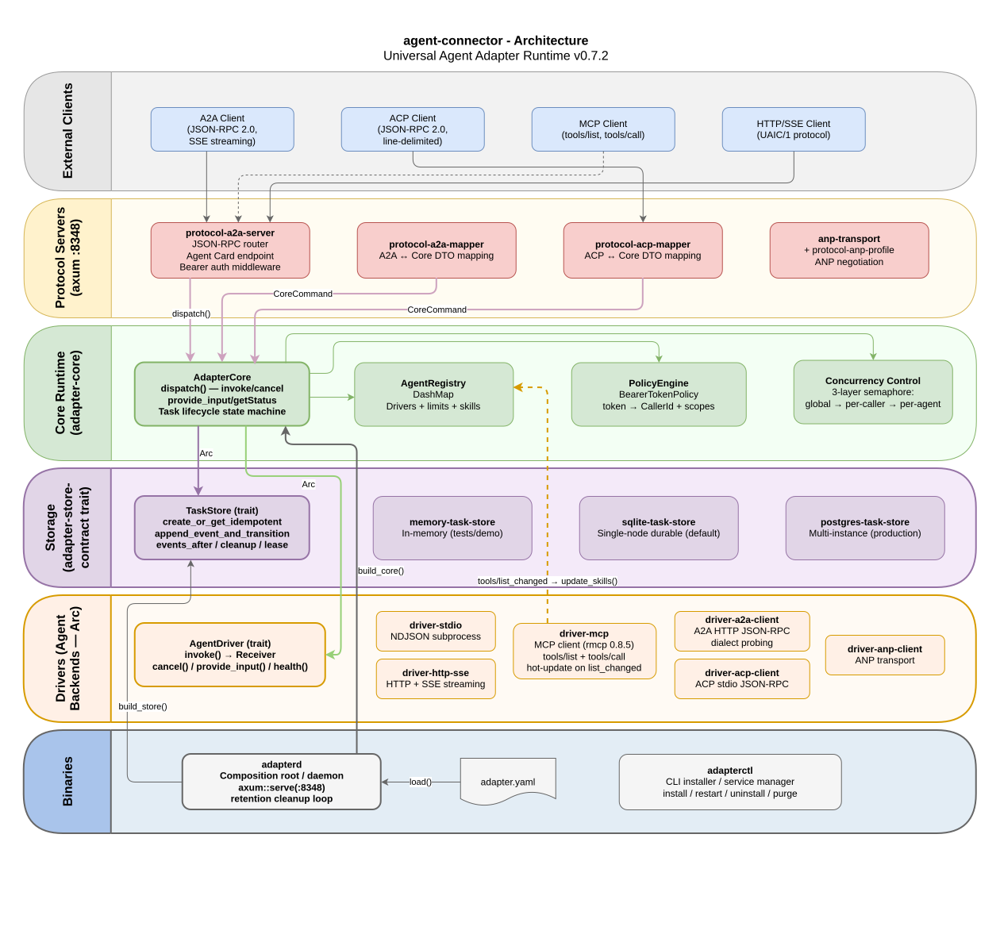

# agent-connector

**Version: 0.7.2**

Universal Agent Adapter Runtime — transport-neutral middleware that exposes
local (stdio) and remote (HTTP/SSE/MCP) agents through a uniform task lifecycle
with durable storage, idempotency, retention and A2A/ACP protocol mappers.

## Layout

```text
agent-connector/
├── Cargo.toml                      # workspace root (resolver = "2"), version = "0.7.2"
├── config/adapter.example.yaml     # образец конфигурации adapterd
├── crates/
│   ├── adapter-model/              # DTO, identifiers, schema (no runtime)
│   ├── adapter-store-contract/     # TaskStore trait + retention
│   ├── adapter-core/               # task lifecycle, registry, policy
│   ├── protocol-a2a-mapper/        # A2A <-> Core semantic mapper
│   ├── protocol-a2a-server/        # A2A HTTP router, health/readiness
│   ├── protocol-acp-mapper/        # ACP <-> Core semantic mapper
│   ├── protocol-acp-runtime/       # ACP stdio runtime
│   ├── driver-stdio/               # UAIC/1 NDJSON subprocess driver
│   ├── driver-http-sse/            # UAIC/1 HTTP+SSE driver
│   ├── driver-mcp/                 # MCP client driver (rmcp 0.8.5)
│   ├── memory-task-store/          # in-memory TaskStore (tests/demo)
│   ├── sqlite-task-store-adapter/  # durable single-node TaskStore
│   ├── postgres-task-store-adapter/# multi-instance TaskStore
│   └── adapterd/                   # composition root / daemon binary
├── docs/                           # entry docs + design/ (исходные спеки)
├── tests/                          # contract / integration / fixtures
├── scripts/                        # check.sh, run-local.sh
└── deploy/                         # docker-compose.postgres.yaml, systemd unit
```

## Architecture



6 слоёв: External Clients → Protocol Servers → Core Runtime → Storage → Drivers → Binaries.

## Quick start (SQLite, local)

```bash
cp config/adapter.example.yaml adapter.yaml
./scripts/check.sh                  # fmt + clippy + test
cargo run -p adapterd -- adapter.yaml
```

Adapterd стартует, создаёт `./data/adapter.db`, поднимает агентов из конфига
(stdio / HTTP+SSE / MCP-транспорт) и выполняет фоновую retention-cleanup.
Логи пишутся через `tracing`.

## Drivers

| Driver | Транспорт | Статус |
|---|---|---|
| `driver-stdio` | UAIC/1 NDJSON subprocess | готов |
| `driver-http-sse` | UAIC/1 HTTP+SSE | готов |
| `driver-mcp` | MCP (rmcp 0.8.5), stdio child-process | готов; discovery/invoke/progress/cancel через `CancellationToken` |

`driver-mcp` подключается к любому MCP-серверу через stdio, обнаруживает
инструменты через `list_tools`, вызывает их через `send_request_with_option`
+ `RequestHandle`, подписывается на progress-события через встроенный
`ProgressDispatcher`, и поддерживает cancel — `RequestHandle` остаётся внутри
spawn'нутой задачи, снаружи передаётся только `CancellationToken`, чтобы
избежать moved-value конфликта между `await_response(self)` и `cancel(self, ..)`.

## Installer: adapterctl

`crates/adapterctl` — installer / service manager (Linux systemd, macOS
launchd, Windows sc.exe):

```bash
sudo adapterctl install --storage sqlite --start     # установить как службу
sudo adapterctl restart                               # перезапустить
sudo adapterctl uninstall --purge-data                # удалить вместе с данными
```

Установка с managed Docker Postgres требует `--confirm-docker`; секреты
(DSN, bearer-токены) пишутся только в `.env` рядом с конфигом — никогда в
`adapter.yaml`. Подробности: `docs/user-guide.md`.

## Design documents

Исходные спеки и архитектура перенесены в `docs/design/`:

- `rust-agent-adapter-architecture.md` — архитектура рантайма
- `universal-agent-adapter-module-specifications.md` — поcrate-спеки
- `universal-agent-adapter-production-nfr.md` — производственные NFR
- `agent-adapter-multi-agent-section.md` — мультиагентная секция
- `a2a-sdk-pinned-dependencies.toml` — пины A2A SDK

Краткая вводная: `docs/architecture.md`. Эксплуатация: `docs/operations.md`.
Совместимость протоколов: `docs/protocol-compatibility.md`.
Пользователь: `docs/user-guide.md`. Контрибуторам: `docs/contributing.md`.

## A2A Protocol Strategy 2026

Protocol-dialect strategy for the gateway and the adapter (A2A SDK v1.0 = base,
Spec pre-1.0 = fallback, ACP = deep fallback, ANP — out of scope). Pick a
language — each opens a short summary linking to the full strategy in that
language:

- **EN:** [A2A-protocol-strategy-2026-en.summary.md](docs/A2A-protocol-strategy-2026-en.summary.md)
- **UA:** [A2A-protocol-strategy-2026-uk.summary.md](docs/A2A-protocol-strategy-2026-uk.summary.md)
- **RU:** [A2A-protocol-strategy-2026-ru.summary.md](docs/A2A-protocol-strategy-2026-ru.summary.md)

## Status

Версия **0.7.2**. Workspace, crates перенесены из плоского прототипа
(`adapter_core_v2_fix.rs` → `adapter-core`, DTO → `adapter-model`),
`cargo fmt --all --check`, `cargo clippy --workspace --all-targets -- -D warnings`,
`cargo test --workspace` проходят.

Реализовано: A2A server (`protocol-a2a-server`), ACP runtime
(`protocol-acp-runtime`), MCP driver (`driver-mcp`, rmcp 0.8.5, stdio + HTTP
транспорты, progress/cancel через `CancellationToken`, input-schema
валидация, проверка версии протокола), installer (`adapterctl`) с
launchd/sc.exe/systemd-слоями и graceful shutdown.

Известные ограничения MCP: hot-update skills при `tools/list_changed`
(нужен restart), multi-turn `input_required` (feature-gate), prompts/resources
не маппятся — см. `docs/design/adr-0001-mcp-dynamic-capabilities.md`.
